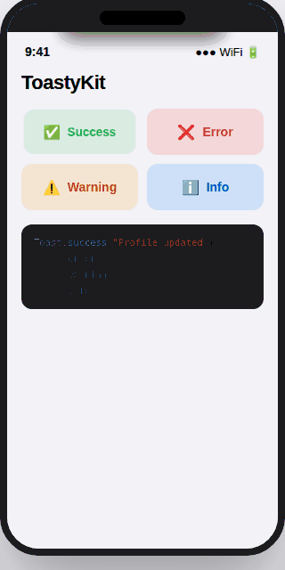

# ToastKit
[](https://swiftpackageindex.com/ErsanQ/ToastKit)
[](https://swiftpackageindex.com/ErsanQ/ToastKit)
<p align="center">
  
  
  
  
</p>

<p align="center">
  Beautiful toast notifications for iOS. One line. Four styles. Zero setup.
</p>

---

<p align="center">
  
</p>
---

## Features

- ✅ `Toast.show("message", style: .success)` — one line anywhere in your app
- ✅ 4 built-in styles — success, error, warning, info
- ✅ Custom colors, duration, and position (top / bottom)
- ✅ Queued — multiple toasts won't overlap
- ✅ Animated spring entrance + smooth exit
- ✅ Tap to dismiss
- ✅ SF Symbols icons
- ✅ Zero dependencies — pure UIKit
- ✅ iOS 16+, visionOS 1+

---

## Installation

```
https://github.com/ErsanQ/ToastKit
```

```swift
.package(url: "https://github.com/ErsanQ/ToastKit", from: "1.0.0")
```

---

## Usage

### One-liners

```swift
Toast.success("Profile updated")
Toast.error("Upload failed")
Toast.warning("Low storage space")
Toast.info("Sync complete")
```

### With duration

```swift
Toast.show("Order placed! 🎉", style: .success, duration: 4)
```

### Bottom position

```swift
Toast.show(
    "Message sent",
    style: .success,
    configuration: ToastConfiguration(position: .bottom)
)
```

### Custom colors

```swift
Toast.show(
    "Premium unlocked ✨",
    style: .custom(background: .purple, foreground: .white)
)
```

### Full configuration

```swift
let config = ToastConfiguration(
    duration: 3.5,
    position: .bottom,
    showIcon: true,
    cornerRadius: 20,
    tapToDismiss: true
)

Toast.show("Done!", style: .success, configuration: config)
```

### Dismiss programmatically

```swift
Toast.dismiss()
```

---

## API Reference

### `Toast`

| Method | Description |
|--------|-------------|
| `show(_:style:configuration:)` | Full control |
| `show(_:style:duration:)` | Quick duration override |
| `success(_:duration:)` | Green toast |
| `error(_:duration:)` | Red toast |
| `warning(_:duration:)` | Orange toast |
| `info(_:duration:)` | Blue toast |
| `dismiss()` | Dismiss current toast |

### `ToastStyle`

`.success` `.error` `.warning` `.info` `.custom(background:foreground:)`

### `ToastConfiguration`

| Property | Default | Description |
|----------|---------|-------------|
| `duration` | `2.5` | Seconds before auto-dismiss |
| `position` | `.top` | `.top` or `.bottom` |
| `showIcon` | `true` | SF Symbol icon |
| `cornerRadius` | `14` | Corner radius |
| `tapToDismiss` | `true` | Tap to dismiss |

---

## Requirements

- iOS 16.0+ / visionOS 1.0+
- Swift 5.9+
- Xcode 15.0+

---

## License

MIT License. See [LICENSE](LICENSE).

---

## Author

Built by **Ersan Q Abo Esha** — [@ErsanQ](https://github.com/ErsanQ)
